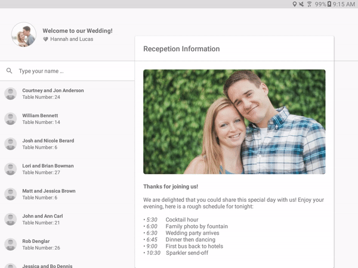

# Wedding Seating Chart

A pretty cool, Material Design, app that I created for the seating chart at my wedding. Has nice animations, nice style, and it works really well.

It is designed for tablets, things are a bit squished on phones, but it works alright.

## Adapting it for your own event

This app could very easily be adapted to host the seating chart for any events. Just set out a few tablets and you are ready to go. 

Check out the [Guest Generator Readme](/guest_generator/README.md) to find out how to import your own guest list instead of using my example one.

For the _welcome message_ displayed on the "Reception Information" [fragment](https://github.com/klinker24/wedding-app/blob/master/app/src/main/java/xyz/klinker/wedding/fragment/ReceptionInfoFragment.java), edit the [WelcomeMessage](https://github.com/klinker24/wedding-app/blob/master/app/src/main/java/xyz/klinker/wedding/data/WelcomeMessage.java). Feel free to use any HTML tags within this message, for the styling.

There are also three different images that are used in the app:

1. A profile image in the top left corner
2. A hero/header image on the "Reception Information" fragment
3. An image of the seating chart

I hosted these images on the internet and use [Glide](https://github.com/bumptech/glide) to download and cache them the first time you open up the app, so that it can be used without an internet connection. I chose to host them so that I did not have to package large images within the app. Feel free to package the images directly with the drawables though if you would rather do this.

To edit the images within the app, and make them your own, check out the [ImageContants](https://github.com/klinker24/wedding-app/blob/master/app/src/main/java/xyz/klinker/wedding/data/ImageConstants.java) class.

---

## License

    Copyright 2016 Luke Klinker

    Licensed under the Apache License, Version 2.0 (the "License");
    you may not use this file except in compliance with the License.
    You may obtain a copy of the License at

       http://www.apache.org/licenses/LICENSE-2.0

    Unless required by applicable law or agreed to in writing, software
    distributed under the License is distributed on an "AS IS" BASIS,
    WITHOUT WARRANTIES OR CONDITIONS OF ANY KIND, either express or implied.
    See the License for the specific language governing permissions and
    limitations under the License.
